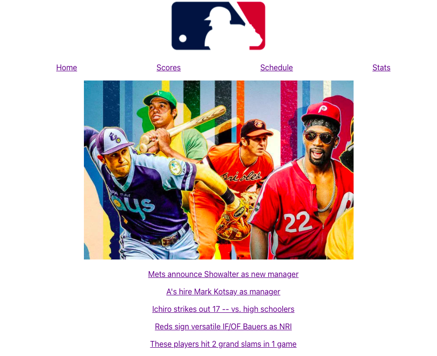

Installation Instructions:
1. Fork and clone this repository
2. CD into the repository, and open in your favorite code editor
3. Run npm install
4. Run npm start
5. Code away

Components:

Code Snippets:

Tests:
